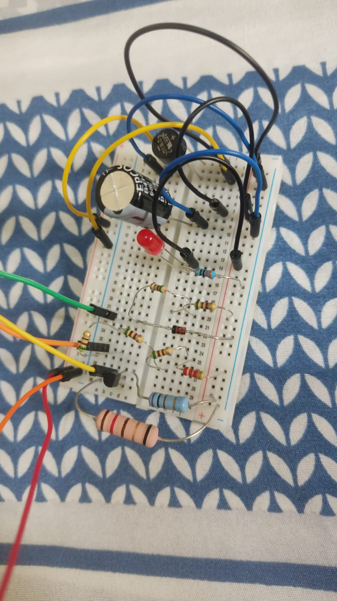
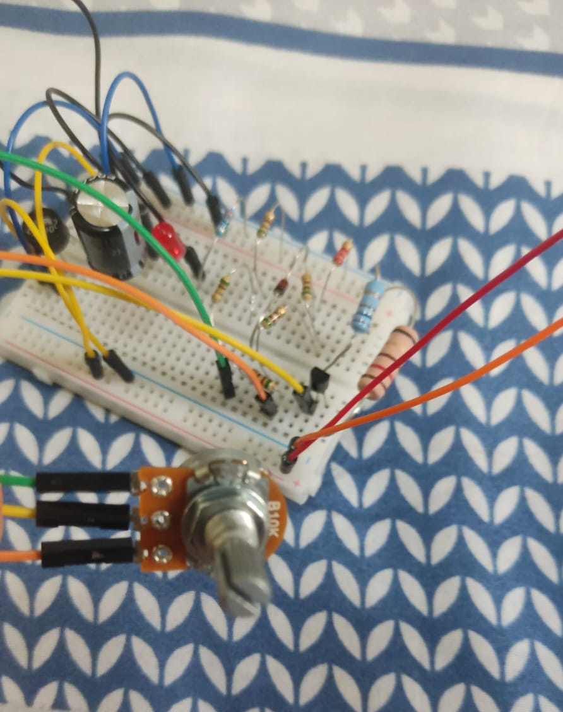

# Relatório do primeiro projeto: Fonte de Tensão Ajustável
O projeto inclui o diagrama esquemático com valores dos componentes, simulação do circuito, layout da placa no Eagle, imagens da montagem física e um vídeo demonstrando o funcionamento e explicando as escolhas dos componentes.

## Tabela de componentes usados & valores

| Componente | Especificação | Valor |
|------------|---------------|-------|
|Capacitor|680uF x 35V|R$6,00|
|1x Leds|5mm|R$0,50|
|1x Diodo|13V 1W|R$0,50|
|1x Protoboard|BB-01 400P|R$21,70|
|1x Potenciômetro|1W B10K|R$7,00|
|1x Ponte Retificadora|2W10M 2A 800V|R$3,90|
|1x Transistor|2N2222A NPN 60V|R$2,60|
|65x Jumper (pacote)|Macho x Macho|R$20,00|
|1x Resistor|1W 3K3|R$0,40|
|5x Resistor|CR25 510R|R$3,50|
|1x Resistor|100R|R$0,40|
|1x Resistor|2K2|R$0,40|
|Total:||R$66,90|

## Link para o circuito no Simulador (Falstad)
https://tinyurl.com/2yxqvy6e

## Projeto Esquemático no EAGLE

## Fotos da Protoboard com o circuito montado

## Vídeo mostrando o Projeto Funcionando
https://youtu.be/LFZHmxOWCVs?feature=shared

# Cálculos

## Antes do transformador

A tensão RMS da tomada é:

V_tomada = 127 V

Portanto, a tensão de pico é:

V_pico_tomada = 127 × √2 ≈ 179,6 V

---

## Após o transformador

A tensão de saída RMS do transformador é 18 V, convertida para pico:

V0_pico ≈ 18 × √2 ≈ 25,5 V

---

## Depois da ponte retificadora

Considerando uma queda de tensão de aproximadamente 2 V na ponte:

V1_pico ≈ 25,5 − 2 ≈ 23,5 V

---

## Buscando a capacitância mínima para um ripple de no máximo 10%

A corrente consumida pelo circuito é aproximadamente:

I_carga ≈ 85 mA

A resistência equivalente da carga é:

R_eq = V / I = 12 V / 0,085 A ≈ 141 Ω

A frequência da retificação de onda completa é:

f = 2 × 60 Hz = 120 Hz

O ripple máximo permitido (10%) é:

V_ripple = 0,10 × V1_pico = 0,10 × 23,5 ≈ 2,35 V

Usando a fórmula:

V_ripple = Vcc / (f × C × R_eq)

Temos:

2,35 = 23,5 / (120 × C × 141)

Resolvendo para C:

120 × 141 = 16.920
2,35 × 16.920 = 39.822
C ≥ 23,5 / 39.822 ≈ 0,000590 F = 590 µF

---

## Com um capacitor de 680 µF, é possível obter um ripple de:

Calculando o ripple real:

V_ripple = 23,5 / (120 × 680e-6 × 141)

Primeiro o denominador:

120 × 680e-6 = 0,0816
0,0816 × 141 = 11,5

Portanto:

V_ripple ≈ 23,5 / 11,5 ≈ 2,04 V

Percentual de ripple:

2,04 / 23,5 ≈ 8,7%

---

## Resumo

Com o capacitor de 680 µF, o ripple fica abaixo de 10%, atendendo ao critério definido.