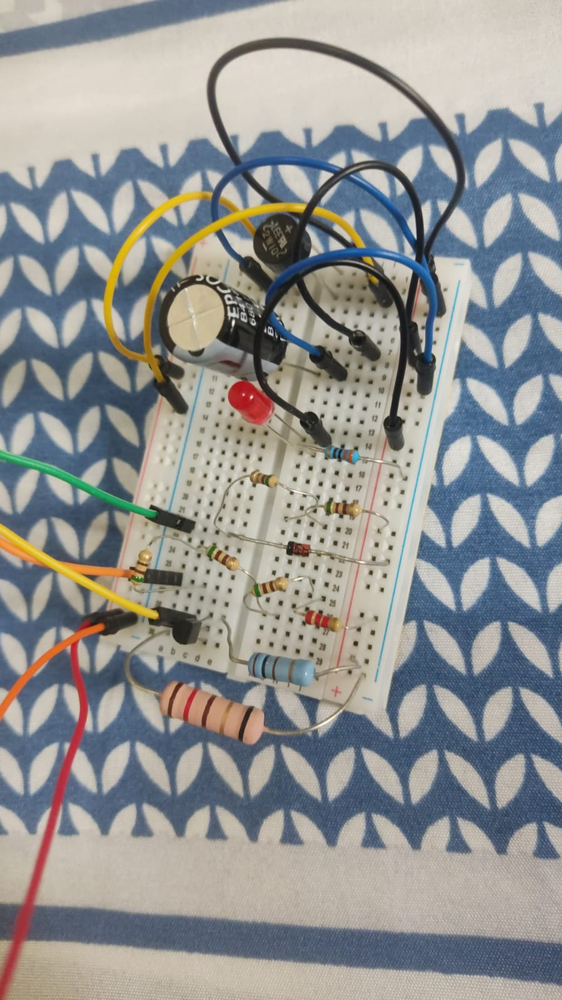
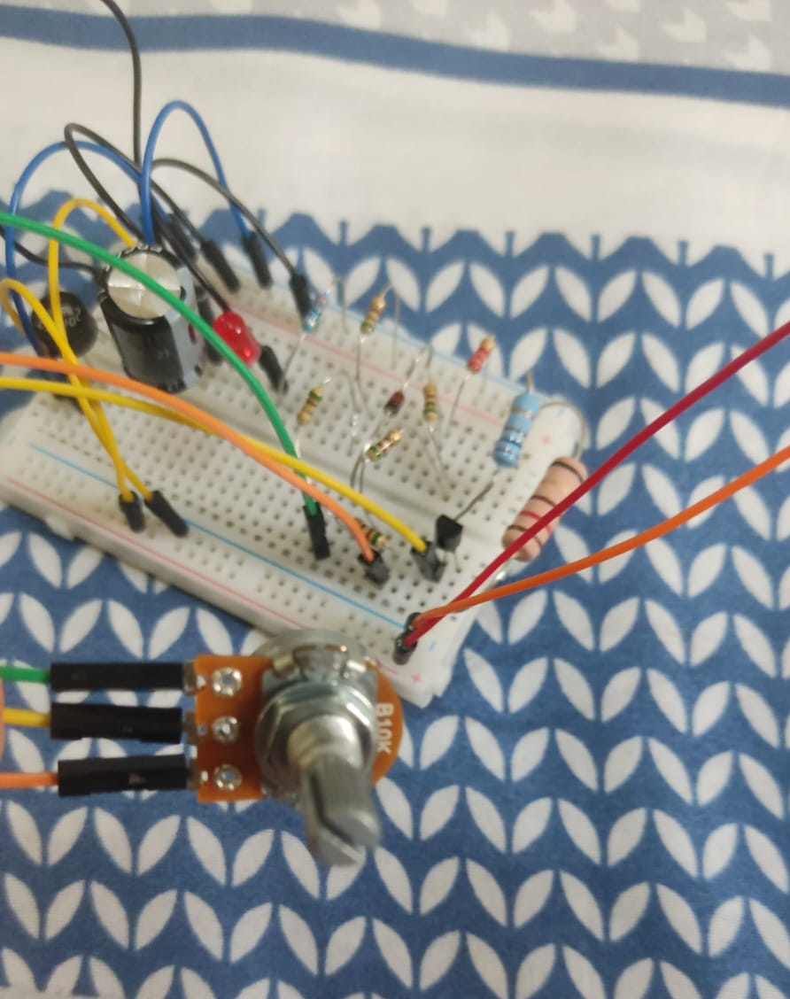

# Relatório do primeiro projeto: Fonte de Tensão Ajustável
O projeto inclui o diagrama esquemático com valores dos componentes, simulação do circuito, layout da placa no Eagle, imagens da montagem física e um vídeo demonstrando o funcionamento e explicando as escolhas dos componentes.

## Tabela de componentes usados & valores

| Componente | Especificação | Valor |
|------------|---------------|-------|
|Capacitor|680uF x 35V|R$6,00|
|1x Leds|5mm|R$0,50|
|1x Diodo|13V 1W|R$0,50|
|1x Protoboard|BB-01 400P|R$21,70|
|1x Potenciômetro|1W B10K|R$7,00|
|1x Ponte Retificadora|2W10M 2A 800V|R$3,90|
|1x Transistor|2N2222A NPN 60V|R$2,60|
|65x Jumper (pacote)|Macho x Macho|R$20,00|
|1x Resistor|1W 3K3|R$0,40|
|5x Resistor|CR25 510R|R$3,50|
|1x Resistor|100R|R$0,40|
|1x Resistor|2K2|R$0,40|
|Total:||R$66,90|

## Link para o circuito no Simulador (Falstad)
https://tinyurl.com/2yxqvy6e

## Projeto Esquemático no EAGLE
|------------|---------------|-------|

## Fotos da Protoboard com o circuito montado

## Vídeo mostrando o Projeto Funcionando
